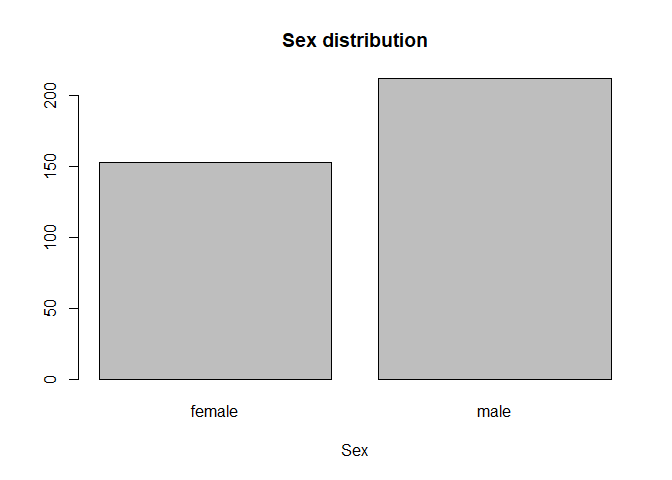
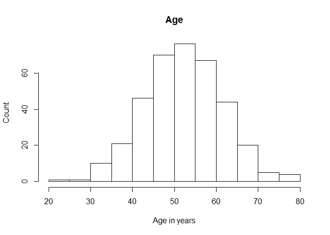
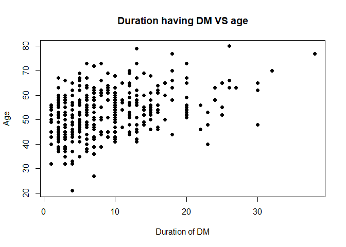
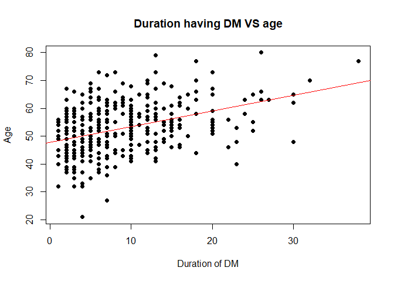
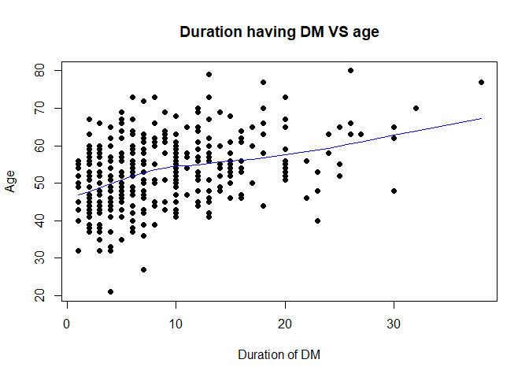
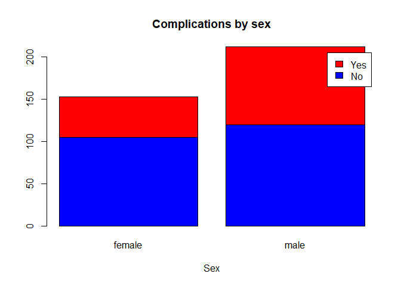
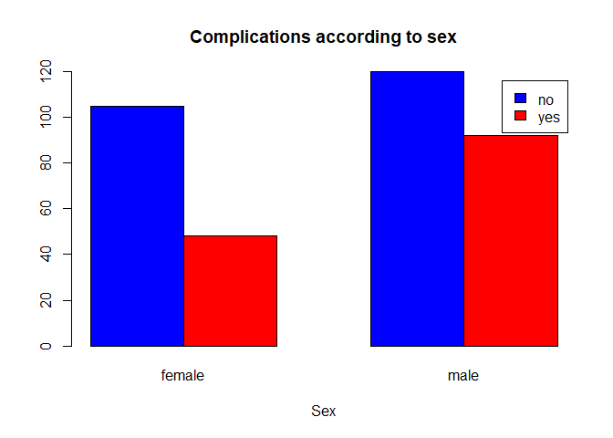

---
output:
  html_document:
    keep_md: yes
---


# Prepare folder and data

## Set the working directory

This can be done in 2 ways:

1. Using codes
2. Using point and click


To use point and click, use the down arrow button next to *More* . Then click 'Set as working directory'

## List the files inside the working directory

All files will be displayed when you click 'Files'.

Or you can use this code,


```r
list.files()
```

```
##  [1] "_book"                     "_bookdown_files"          
##  [3] "01-intro.knit.md"          "01-intro.md"              
##  [5] "01-intro.Rmd"              "01-intro.utf8.md"         
##  [7] "02-text.Rmd"               "03-Grammar_of_Var.knit.md"
##  [9] "03-Grammar_of_Var.md"      "03-Grammar_of_Var.Rmd"    
## [11] "03-Grammar_of_Var.utf8.md" "04-EDA_Graphs.Rmd"        
## [13] "04-report.Rmd"             "05-graphical.Rmd"         
## [15] "06-references.Rmd"         "07-summary.Rmd"           
## [17] "book chapters.Rproj"       "cholest.csv"              
## [19] "cholest.dta"               "cholest.sav"              
## [21] "cholest.xlsx"              "eye.csv"                  
## [23] "eye.dta"                   "eye.sav"                  
## [25] "eye.xlsx"                  "index.Rmd"                
## [27] "metab1.csv"                "metab1.dta"               
## [29] "qol.csv"                   "qol.dta"                  
## [31] "qol.sav"                   "qol.xlsx"                 
## [33] "site"                      "Template_R_bookdown"
```

## Reading dataset from SPSS file (.sav) 

Dataset in SPSS format will end with .sav. To read SPSS data into R we use 'foreign' library. 

Create a object to represent the SPSS data that we will read into R.  


```r
library(foreign)
dataSPSS<-read.spss('qol.sav', to.data.frame = TRUE)
```

```
## re-encoding from UTF-8
```


# Describing data

Let us examine the data


```r
str(dataSPSS)
```

```
## 'data.frame':	365 obs. of  13 variables:
##  $ id       : num  308 335 94 329 350 22 171 274 332 147 ...
##  $ sex      : Factor w/ 2 levels "female","male": 1 2 1 1 1 2 1 1 2 2 ...
##  $ age      : num  55 41 50 47 67 57 60 54 60 45 ...
##  $ tahundx  : num  14 4 5 10 13 4 4 15 13 3 ...
##  $ tx       : Factor w/ 4 levels "diet only","OHA and diet only",..: 3 4 2 4 4 2 2 2 4 2 ...
##  $ group    : Factor w/ 2 levels "\"group A\"",..: 2 2 1 2 2 1 1 1 2 1 ...
##  $ complica : Factor w/ 2 levels "no","yes": 2 1 1 2 1 2 1 1 2 1 ...
##  $ hba1c    : num  8.1 8 7.5 9.4 11.7 8.1 7.5 9.2 NA NA ...
##  $ fbs      : num  6.9 4.8 8 3.6 12.5 8.5 NA NA NA NA ...
##  $ rbs      : num  16.7 7.4 13.2 7.4 NA 7.8 9.4 7.8 NA 12.4 ...
##  $ tg_total : num  0.92 1.66 0.74 0.94 3.01 1.3 NA 1.9 NA NA ...
##  $ choleste : num  7.09 2.91 5.94 3.27 7.1 3.54 NA 5.7 NA NA ...
##  $ ADDQSCORE: num  0 -0.222 -0.333 -0.36 -0.44 ...
##  - attr(*, "variable.labels")= Named chr  "id_no" "sex" "" "" ...
##   ..- attr(*, "names")= chr  "id" "sex" "age" "tahundx" ...
##  - attr(*, "codepage")= int 65001
```

Now, let us summarize our data


```r
summary(dataSPSS)
```

```
##        id            sex           age           tahundx      
##  Min.   :  1.0   female:153   Min.   :21.00   Min.   : 1.000  
##  1st Qu.:126.0   male  :212   1st Qu.:47.00   1st Qu.: 4.000  
##  Median :227.0                Median :53.00   Median : 7.000  
##  Mean   :221.5                Mean   :52.75   Mean   : 8.795  
##  3rd Qu.:325.0                3rd Qu.:59.00   3rd Qu.:12.000  
##  Max.   :416.0                Max.   :80.00   Max.   :38.000  
##                                                               
##                      tx            group     complica      hba1c       
##  diet only            : 10   "group A":248   no :225   Min.   : 4.100  
##  OHA and diet only    :238   "group B":117   yes:140   1st Qu.: 7.500  
##  insulin and diet only: 26                             Median : 9.050  
##  all                  : 91                             Mean   : 9.301  
##                                                        3rd Qu.:10.775  
##                                                        Max.   :19.900  
##                                                        NA's   :111     
##       fbs              rbs            tg_total        choleste     
##  Min.   : 2.700   Min.   : 3.900   Min.   :0.380   Min.   : 2.020  
##  1st Qu.: 5.700   1st Qu.: 7.925   1st Qu.:1.125   1st Qu.: 4.308  
##  Median : 8.000   Median :11.300   Median :1.570   Median : 5.210  
##  Mean   : 9.003   Mean   :12.045   Mean   :2.002   Mean   : 5.437  
##  3rd Qu.:11.900   3rd Qu.:15.000   3rd Qu.:2.385   3rd Qu.: 6.423  
##  Max.   :29.200   Max.   :31.500   Max.   :8.020   Max.   :13.100  
##  NA's   :178      NA's   :83       NA's   :191     NA's   :181     
##    ADDQSCORE     
##  Min.   :-9.000  
##  1st Qu.:-5.590  
##  Median :-3.944  
##  Mean   :-4.179  
##  3rd Qu.:-2.556  
##  Max.   : 0.000  
## 
```

# Graphing or Plotting data

You must ask yourselves these:
1.  Which variable do you want to plot?
2.  What is the type of that variable? Factor? Numerical?
3.  Are you going to plot another variable together?

## One variable: A categorical or factor variable

We can create a simple barchart


```r
dist.sex<-table(dataSPSS$sex)
barplot(dist.sex,
        main='Sex distribution',
        xlab='Sex')
```

<!-- -->


## One variable: A numerical variable

histogram


```r
hist(dataSPSS$age, main = 'Age',
     xlab='Age in years',
     ylab='Count')
```

<!-- -->

## Two variables : A numerical with another numerical variable

We will use *scatterplot* to plot 


```r
plot(dataSPSS$tahundx, dataSPSS$age,
     main = 'Duration having DM VS age',
     xlab = 'Duration of DM', ylab = 'Age',
     pch = 19)
```

<!-- -->

Let us make a fit line


```r
plot(dataSPSS$tahundx, dataSPSS$age,
     main = 'Duration having DM VS age',
     xlab = 'Duration of DM', ylab = 'Age',
     pch = 19)
abline(lm(dataSPSS$age~dataSPSS$tahundx), col = 'red')
```

<!-- -->

and a lowess 


```r
plot(dataSPSS$tahundx, dataSPSS$age,
     main = 'Duration having DM VS age',
     xlab = 'Duration of DM', ylab = 'Age',
     pch = 19)
lines(lowess(dataSPSS$tahundx,dataSPSS$age), col = 'blue')
```

<!-- -->

## Two variables : A categorical variable with a categorical variable

Now, we will plot 2 categorical variables simultenously.

First, we will use stacked barchart


```r
compl.sex<-table(dataSPSS$complica,dataSPSS$sex)
compl.sex
```

```
##      
##       female male
##   no     105  120
##   yes     48   92
```

```r
barplot(compl.sex,
        main='Complications by sex',
        xlab='Sex',
        col=c('blue','red'),
        legend=c('No','Yes'))
```

<!-- -->

Next, we will use grouped barchart


```r
compl.sex
```

```
##      
##       female male
##   no     105  120
##   yes     48   92
```

```r
barplot(compl.sex,
        main = 'Complications according to sex',
        xlab = 'Sex',
        col = c('blue','red'),
        legend = c('no','yes'),
        beside = TRUE)
```

<!-- -->


