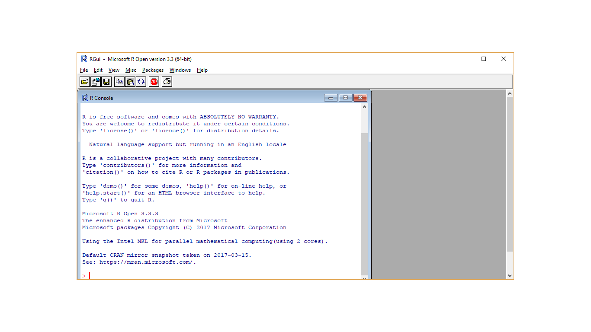

# Preparing R 

## Objectives

The objectives of this lecture are:

1.  To ensure that the installation of R is correct
2.  To ensure that the installation of RStudio is correct
3.  To be able to install R packages
4.  To be able to create a working directory


### Installation of R

- The latest version of R is `r version[13:14]`.
- R can be installed inside Linux, Mac OS and Windows (of course)
- The installation files (tar.gz, binaries) can be downloaded from <https://cran.r-project.org/>
- Users can install different versions of R in a same machine or computer
- There is no need to uninstall if you want to upgrade currently installed R


#### Starting R

Double click on R icon and you should get this



### Installation of RStudio

First, make sure you have RStudio successfully installed. 


#### Starting RStudio

You can double click on RStudio icon and you will see this:


#### Why RStudio?

- Working with R GNU is alright. 
- But for many people, they prefer to communicate with R using a GUI
- RStudio is a popular GUI
- But RStudio is not only a GUI
- RStudio is the popular IDE for R
- Other R IDE includes Microsoft R

Check this links for more info:

1.  RStudio <https://www.rstudio.com/>
2.  Microsoft R <http://blog.revolutionanalytics.com/2016/01/microsoft-r-open.html>


#### RStudio interface

- Depending on your OS, you may start RStudio differently. 
- Here we assume you are working with Windows OS
- You should be able to see 4 panes in the layout.

#### RStudio panes

You should see that
- the lower left pane tells you about your R information (the console pane)
- the upper left pane is to show files that are open
- the upper right for the 'Environment, History and Presentation' pane
- the lower right pane is for to list file names, show plots, show packages, display help document and view outputs (such as html file) 


## Installing packages 

R uses packages to perform its tasks.

There are two common packages:

1.  `base` packages 
2.  `user-contributed` packages

- The base packages come with the installation of R
- The base package provides basic but adequate functions to perform many standard data management, visualization and analysis.
- However, user needs to install user-contributed packages if they need to perform functions (tasks) not available in the base package
- User-contributed packages allow users to perform more advanced and more complicated functions 
- There are more than 10200 packages as of March 2017

For a complete list of packages, see <https://cran.r-project.org/web/packages/>

### Package installation

You can install user-contributed packages through:

1.  internet (to cran)
2.  Github packages
3.  local zip files

In this session, we will learn to install a few small packages. I have installed them. For those who have not, 

1.  put your cursor in the CONSOLE pane
2.  type the codes below

```{r, eval=FALSE}
install.packages(foreign)
install.packages(haven)
```

3.  click ENTER

## Workflow

We propose that you always have these steps as your workflow when working with R:

1.  Set working directory
2.  Read data
3.  Explore + Clean data
4.  Build Model
5.  Check Model

## Working directory

This is a good practice. 

User must create or specify the working directory to work with R. 

The working directory:

1.  stores all the outputs such as the plots, html files, pdf files 
2.  contains your data

Creating a working directory is a simple BUT an important step. 

Unfortunately, many users do not pay attention to this and forget to set it. So, pay attention so you will not get lost.

### Creating your working directory

Follow this steps:

1.  Make a folder in D directory D:\
2.  Name it as *myfolder*

You will see this:


### Setting your working directory

To set your working directory:

1.  Go back to RStudio pane
2.  In the FILE pane, click the *three small dots* 
3.  Navigate to *myfolder*
4.  Click *More* 
5.  Click *Set as working directory*

- or simply use *setwd* to do so. 


```{r createdir}
setwd('D:/myfolder')
```

- type *getwd* to confirm

```{r}
getwd()
```

