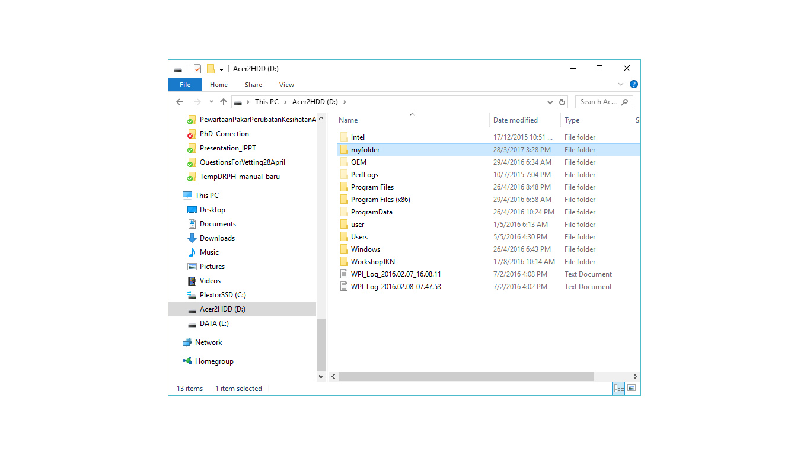

<!--chapter:end:index.Rmd-->

# Introduction to R

## Installing R and RStudio
Install R base package: http://www.r-project.org/

Install RStudio: http://www.rstudio.com/

## Getting familiar with the interface
Consists of 4 tabs:
1. Source
2. Console
3. Environment & History
4. Misc. Most important Plots, Packages & Help

## Basic tasks in R
### R Script
Text here.

### Setting working directory
Text here.

### Packages
Text here.

#### Installation
```{r eval=FALSE}
install.packages("package.name")
```
#### Loading
```{r eval=FALSE}
library("package.name")
```

### Data management
Text here.

#### Loading data
```{r eval=FALSE}
read.csv("file.name")
```
For SPSS file, need `foreign` package
```{r eval=FALSE}
library("foreign")
read.spss("file.name")
```
#### Data dimension
```{r eval=FALSE}
dim(data)
```

#### Entering data
text here

#### Editing data
text here

<!--chapter:end:01-intro.Rmd-->

# Textual
In this chapter, we will go through a number of R functions for basic statistics. We will mostly use the builtin functions (from R standard library). Extra packages will be introduced whenever necessary.

## Descriptive statistics
We are going to use builtin datasets in R. You can view the available datasets by
```{r}
data()
```

```{r}
## Data sets in package ‘datasets’:

## AirPassengers                     Monthly Airline Passenger Numbers 1949-1960
## BJsales                           Sales Data with Leading Indicator
## BJsales.lead (BJsales)            Sales Data with Leading Indicator
## BOD                               Biochemical Oxygen Demand
## CO2                               Carbon Dioxide Uptake in Grass Plants
## ...
```

View the data, for example
```{r}
women
```
View the dimension, i.e. number of subjects and variables
```{r}
dim(women)
```

Obtaining mean
```{r}
mean(women$weight)
```
and median
```{r}
median(women$weight)
```
and sd
```{r}
sd(women$weight)
```
and IQR
```{r}
IQR(women$weight)
```
There 9 types of IQR in R, the default one is type 7. You may change this to type 6 (Minitab and SPSS),
```{r}
IQR(women$weight, type = 6)
```
and minimum, maximum and range
```{r}
min(women$weight)
max(women$weight)
range(women$weight)
```

However, it is actually simpler to obtain most these in one single command for both weight and height
```{r}
summary(women)
```
even simpler, all of the statistics using *psych* package
```{r eval = FALSE}
install.packages("psych")
```

```{r}
library(psych)
describe(women)
```


## Tables

### Count, proportion, percentage and cross-tabulation
Use *birthwt* dataset from MASS package.
```{r eval=FALSE}
install.packages("MASS")
```

```{r}
library(MASS)
head(birthwt)  # First six subjects
```

Count and proportion,
```{r}
table(birthwt$smoke)
prop.table(table(birthwt$smoke))
```

Cross-tabulation of smoking vs low birth weight baby,
```{r}
table(birthwt$smoke, birthwt$low)  # without row/column labels
table("Smoking status" = birthwt$smoke, "Low birth weight" = birthwt$low)  # with row/column labels
```
To add value labels to the data for a nicer table, we use *factor*
```{r}
birthwt$smoking = factor(birthwt$smoke, levels = 0:1, labels = c("Non-smoker", "Smoker"))
birthwt$low.weight = factor(birthwt$low, levels = 0:1, labels = c("Low <2.5kg", "Normal >2.5kg"))
head(birthwt)  # we added two new variables with factors
table(birthwt$smoking)
prop.table(table(birthwt$smoking))*100  # in percent
cbind(n = table(birthwt$smoking), "%" = 100*prop.table(table(birthwt$smoking)))  # using cbind
table(birthwt$smoking, birthwt$low.weight)
```
Save table for later view and analysis,
```{r}
smoke.x.weight = table(birthwt$smoking, birthwt$low.weight)
smoke.x.weight
```

### Entering table data
```{r}
smoking = as.table(rbind(c(15, 5), c(7, 13)))
smoking
str(smoking)
dimnames(smoking) = list(
  Smoking = c("Yes", "No"),
  Lung.CA = c("Yes", "No")
)
smoking
```

<!--chapter:end:02-text.Rmd-->

# Graphical

Test GIT
Test GIT 2 - commit

<!--chapter:end:03-graphical.Rmd-->

# Reporting results

<!--chapter:end:04-report.Rmd-->

# Data and variable manipulation 

# Grammar of variables 

## Prepare folder and data

### Set the working directory

This can be done in 2 ways:

1. Using codes
2. Using point and click


To use point and click, use the down arrow button next to *More* . Then click 'Set as working directory'

## Read Data

```{r}
library(foreign)
data_qol<-read.dta('qol.dta',convert.factors = T)
str(data_qol)
```

## Browse data

1.  First few rows
2.  Last few rows

```{r}
head(data_qol)
tail(data_qol)
```

## Grammar of variables 

### Select columns

## Select columns

Let us create a new dataframe with only id, sex and hba1c as the variables

```{r}
data_qol2<-subset(data_qol, select = c('sex', 'age', 'hba1c'))
str(data_qol2)
```

alternatively, we can use other subsetting functions

```{r}
data_qol3<-data_qol[,c('sex','age','hba1c')]
str(data_qol3)
```

### Select rows

```{r}
data_qol4<-subset(data_qol, age > 30)
str(data_qol4)
summary(data_qol4$age)
```

alternatively, we can use other subsetting functions

```{r}
data_qol5<-data_qol[data_qol$age>30,]
str(data_qol5)
summary(data_qol5$age)
```

### Select rows and columns together

```{r}
data_qol6<-subset(data_qol,age>30 & sex=='male', select = c(id, sex, age, group))
str(data_qol6)
table(data_qol6$sex)
```

### Generate a new variable

```{r}
data_qol$age_cat<-data_qol$age
View(data_qol)
```

### Categorize into new variables

#### From a numerical variable

```{r}
data_qol$age_cat<-cut(data_qol$age_cat,
                      breaks=c(min(data_qol$age),40,60,Inf),
                      labels=c('min-39','40-59','60-above'))
min(data_qol$age)
table(data_qol$age_cat)
str(data_qol$age_cat)
```

#### From a categorical variable

```{r}
table(data_qol$tx)
str(data_qol$tx)
```

Create a variable with 'Diet only' vs 'Diet+Drug'. This is a little bit complicated

```{r}
data_qol$tx2<-data_qol$tx
str(data_qol$tx2)
str(data_qol$tx)
table(data_qol$tx2)

library(plyr)
data_qol$tx2<-revalue(data_qol$tx,c('diet only'='diet', 'OHA and diet only'='med',
                                    'insulin and diet only'='med', 'all'='med'))
table(data_qol$tx2)
```


### Dealing with missing data

```{r}
data_qol$tx3<-data_qol$tx
str(data_qol$tx3)
str(data_qol$tx)
table(data_qol$tx3)
```

#### Replace values with 'NA'

```{r}
data_qol$tx3<-revalue(data_qol$tx,c('diet only'=NA))
table(data_qol$tx3)
str(data_qol$tx3)
```

<<<<<<< HEAD
## Additional packages
=======
## Additional package
>>>>>>> b1e7fe217da24c9c49c585f8cb7b29c3a03e88ce

### Package 'dplyr'

'dplyr' package is a very useful package that encourage users to use proper verb when manipulating variables (columns) and observations (rows)

It has 9 useful functions
1.  filter()
2.  arrange()
3.  select()
4.  distinct()
5.  mutate() and transmute()
6.  summarise()
7.  sample_n() and sample_frac()

Package 'dplyr' is very useful when it is combined with another function that is 'group_by'

`


<!--chapter:end:05-Grammar_of_Var.Rmd-->

# Exploratory data analysis


## Prepare folder and data

### Set the working directory

## Prepare folder and data

## Set the working directory

This can be done in 2 ways:

1. Using codes
2. Using point and click


To use point and click, use the down arrow button next to *More* . Then click 'Set as working directory'

### List the files inside the working directory

All files will be displayed when you click 'Files'.

Or you can use this code,

```{r}
list.files()
```

### Reading dataset from SPSS file (.sav) 

Dataset in SPSS format will end with .sav. To read SPSS data into R we use 'foreign' library. 

Create a object to represent the SPSS data that we will read into R.  

```{r}
library(foreign)
dataSPSS<-read.spss('qol.sav', to.data.frame = TRUE)
```


## Describing data

Let us examine the data

```{r}
str(dataSPSS)
```

Now, let us summarize our data

```{r}
summary(dataSPSS)
```

## Graphing or Plotting data

You must ask yourselves these:
1.  Which variable do you want to plot?
2.  What is the type of that variable? Factor? Numerical?
3.  Are you going to plot another variable together?

### One variable: A categorical or factor variable

We can create a simple barchart

```{r}
dist.sex<-table(dataSPSS$sex)
barplot(dist.sex,
        main='Sex distribution',
        xlab='Sex')
```


### One variable: A numerical variable

histogram

```{r}
hist(dataSPSS$age, main = 'Age',
     xlab='Age in years',
     ylab='Count')
```

### Two variables : A numerical with another numerical variable

We will use *scatterplot* to plot 

```{r}
plot(dataSPSS$tahundx, dataSPSS$age,
     main = 'Duration having DM VS age',
     xlab = 'Duration of DM', ylab = 'Age',
     pch = 19)
```

Let us make a fit line

```{r}
plot(dataSPSS$tahundx, dataSPSS$age,
     main = 'Duration having DM VS age',
     xlab = 'Duration of DM', ylab = 'Age',
     pch = 19)
abline(lm(dataSPSS$age~dataSPSS$tahundx), col = 'red')
```

and a lowess 

```{r}
plot(dataSPSS$tahundx, dataSPSS$age,
     main = 'Duration having DM VS age',
     xlab = 'Duration of DM', ylab = 'Age',
     pch = 19)
lines(lowess(dataSPSS$tahundx,dataSPSS$age), col = 'blue')
```

### Two variables : A categorical variable with a categorical variable

Now, we will plot 2 categorical variables simultenously.

First, we will use stacked barchart

```{r}
compl.sex<-table(dataSPSS$complica,dataSPSS$sex)
compl.sex
barplot(compl.sex,
        main='Complications by sex',
        xlab='Sex',
        col=c('blue','red'),
        legend=c('No','Yes'))
```

Next, we will use grouped barchart

```{r}
compl.sex
barplot(compl.sex,
        main = 'Complications according to sex',
        xlab = 'Sex',
        col = c('blue','red'),
        legend = c('no','yes'),
        beside = TRUE)
```


<!--chapter:end:06-EDA_Graphs.Rmd-->


# Preparing R 

## Objectives

The objectives of this lecture are:

1.  To ensure that the installation of R is correct
2.  To ensure that the installation of RStudio is correct
3.  To be able to install R packages
4.  To be able to create a working directory


### Installation of R

- The latest version of R is `r version[13:14]`.
- R can be installed inside Linux, Mac OS and Windows (of course)
- The installation files (tar.gz, binaries) can be downloaded from <https://cran.r-project.org/>
- Users can install different versions of R in a same machine or computer
- There is no need to uninstall if you want to upgrade currently installed R


#### Starting R

Double click on R icon and you should get this


### Installation of RStudio

First, make sure you have RStudio successfully installed. 


#### Starting RStudio

You can double click on RStudio icon and you will see this:


#### Why RStudio?

- Working with R GNU is alright. 
- But for many people, they prefer to communicate with R using a GUI
- RStudio is a popular GUI
- But RStudio is not only a GUI
- RStudio is the popular IDE for R
- Other R IDE includes Microsoft R

Check this links for more info:

1.  RStudio <https://www.rstudio.com/>
2.  Microsoft R <http://blog.revolutionanalytics.com/2016/01/microsoft-r-open.html>


#### RStudio interface

- Depending on your OS, you may start RStudio differently. 
- Here we assume you are working with Windows OS
- You should be able to see 4 panes in the layout.

#### RStudio panes

You should see that
- the lower left pane tells you about your R information (the console pane)
- the upper left pane is to show files that are open
- the upper right for the 'Environment, History and Presentation' pane
- the lower right pane is for to list file names, show plots, show packages, display help document and view outputs (such as html file) 


## Installing packages 

R uses packages to perform its tasks.

There are two common packages:

1.  `base` packages 
2.  `user-contributed` packages

- The base packages come with the installation of R
- The base package provides basic but adequate functions to perform many standard data management, visualization and analysis.
- However, user needs to install user-contributed packages if they need to perform functions (tasks) not available in the base package
- User-contributed packages allow users to perform more advanced and more complicated functions 
- There are more than 10200 packages as of March 2017

For a complete list of packages, see <https://cran.r-project.org/web/packages/>

### Package installation

You can install user-contributed packages through:

1.  internet (to cran)
2.  Github packages
3.  local zip files

In this session, we will learn to install a few small packages. I have installed them. For those who have not, 

1.  put your cursor in the CONSOLE pane
2.  type the codes below

```{r, eval=FALSE}
install.packages(foreign)
install.packages(haven)
```

3.  click ENTER

## Workflow

We propose that you always have these steps as your workflow when working with R:

1.  Set working directory
2.  Read data
3.  Explore + Clean data
4.  Build Model
5.  Check Model

## Working directory

This is a good practice. 

User must create or specify the working directory to work with R. 

The working directory:

1.  stores all the outputs such as the plots, html files, pdf files 
2.  contains your data

Creating a working directory is a simple BUT an important step. 

Unfortunately, many users do not pay attention to this and forget to set it. So, pay attention so you will not get lost.

### Creating your working directory

Follow this steps:

1.  Make a folder in D directory D:\
2.  Name it as *myfolder*

You will see this:



### Setting your working directory

To set your working directory:

1.  Go back to RStudio pane
2.  In the FILE pane, click the *three small dots* 
3.  Navigate to *myfolder*
4.  Click *More* 
5.  Click *Set as working directory*

- or simply use *setwd* to do so. 


```{r createdir}
setwd('D:/myfolder')
```

- type *getwd* to confirm

```{r}
getwd()
```


<!--chapter:end:07-preparing-R.Rmd-->

# Reading statistical data

## Objectives

At the end of the lecture, participants are:

1.  able to read various data formats into R
2.	able to export data from R into various data format
3.	able to create R-markdown document 


## Data formats 

R can read datasets from different formats.

The `base` package enables us to read `.txt` and `.csv` files. 

You can also use the point and click method to read data. Go to File -> Import Dataset -> From ...

To read datasets from SPSS (`.sav`), Stata (`.dta`), Excel (`xlsx`) and SAS, we need to load special packages. 

There are more than 1 packages you can use to read and write data from/to different spreadsheet or statistical software.

The packages include:

1.  `haven` 
2.  `foreign`
3.  `readxl`
4.  `readr`

## Reading data into R

### Reading csv file

Let us read a `.csv` files names as `metab.csv`.

We would like to create an object named as `met_data` to represent the read `metab.csv`. We can do this: 

```{r}
met_data <- read.csv('metab1.csv', header = TRUE)
```

header = TRUE means that you will read the first row as the variable names. 

After you have done this, you will see a new object named as `met_data` inside the *environment* pane. 


### Reading dataset from MS Excel file 

You can read dataset from Excel using 2 methods

1. point and click method. File - Import Dataset - from Excel
2. `readxl` package

To read data using specific packages such as `readxl` package:

1.  you need to install the library first using `install.packages()`
2.  After that, load the library using `library(readxl)`
3.  Type `read_excel()` with relevant arguments to read the data into RStudio

```{r , eval=TRUE, echo=FALSE}
#install.packages('readxl')

```


```{r}
library(readxl)
dataexcel <- read_excel('eye.xlsx', sheet = 1)
```

The example above means that we read an MS Excel file named as  `eye.xlsx` and named it as `dataexcel`.


### Reading dataset from SPSS file (.sav) 

Dataset in SPSS format will end with `.sav`. 

To read SPSS data into R we may use `foreign` or `haven` packages. 

After reading the `.sav` file, an object will be created based on what we named it. 

The example below shows that an object named as `dataSPSS`represents the SPSS data `cholest.sav`that we just read into RStudio.  

```{r}
library(foreign)
dataSPSS <- read.spss('cholest.sav', to.data.frame = TRUE)
```

### Reading dataset from Stata (.dta)

Dataset in Stata format will end with `.dta`. 

To read Stata data into R we may use `foreign` or `haven` packages. 

After reading the `.dta` file, similarly an object will be created - in this case, we named it as `dataSTATA`. 

`dataSTATA` is an object that represents the Stata data (now in the memory) that we just read `metab1.dta`into RStudio.


```{r}
datastata <- read.dta('metab1.dta', convert.factors = TRUE)
```

### Alternative methods or package

1.  You can go to File - Read Datasets
2.  You may use **haven** package to read SAS, SPSS and Stata file.

```{r}
library(haven)
dataSPSS2 <- read_sav('cholest.sav')
dataSTATA2 <- read_dta('cholest.dta')
```

### Other data format

Other important data formats that might be useful in epidemiology and statistics are:

1.  shapefile `.shp` 
2.  text file `.txt`
3.  text file `.dat`
4.  `XML` file
5.  images file `DICOM`

We will not cover these today. 

## Exporting data from R

You can also export data into various formats using similar packages.

For example, 

1.  to export data into a *comma separated version* (.csv) file, we can use `write.csv` function. 
2.  to export data into stata format, we can use `write.dta` function

```{r}
export_csv <- write.csv(dataSPSS, 'export_csv.csv')
export_stata <- write.dta(dataexcel, 'export_stata.dta') 
```


<!--chapter:end:08-reading-statistical-data-in-R.Rmd-->

# GLM


### Objectives

At the end of the lecture, participants are

1.  able to perform linear regression
2.  able to perform logistic regression
3.  able to perform Cox proportional hazard regression

## Set working directory

Set your working directory. 

This is a folder that contains your dataset and objects created by R.


## Read data

We will read a stata data into R. This file will read using **foreign** package.

We will name the object as **data1** as an object that represent the dataset.

This object is a `data.frame` object

The **data1** object will remain in the memory unless you close your RStudio. 

```{r}
library(foreign)
data1 <- read.dta('metab1.dta', convert.factors = TRUE) 
head(data1)
```

We use `head()` function to list the first 6 observations in the dataset.


## Explore and clean data

Next we will describe the data and visualize 

1.  Descriptive
2.  Visualization

### Descriptive analysis

We will check basic descriptive statistics from our data

```{r}
library(psych)
describe(data1)
```


### Visualization

We do not have time to cover for data vizualition. 

But for here we would do

1.  histogram
2.  bar charts
3.  box-plots
4.  scatterplots

To examine the distribution of our data. 

Briefly:

```{r}
hist(data1$age)
```

```{r}
cts_sex <- table(data1$sex)
barplot(cts_sex, names.arg = c('male','female'))
```

```{r}
cor(data1[,c(2,7:14 )], use = 'complete.obs')
```


## Linear regression

We perform linear regression when we assume that distribution of the outcome variables is normally distributed as a function of certain covariates (independent variables)

### Estimation

To perform the estimation for linear regression, we can use `lm()` function. 

Let us model body mass index *bmi* as a function of hip circumference, mean systolic blood pressure *msbp*, mean diastolic blood pressure *mdbp* and *gender*

```{r}
modl <- lm(bmi2 ~ hip + msbp + mdbp 
           + gender, data = data1)
summary(modl)
```

From the results, we can see that:

1.  71.5% of variation in the expected *bmi* is explained by the covariates
2.  all covariates are siginificantly (p < 0.05) predictive of *bmi*

### Inference

Now, let us calculate the 95% of the expected mean of bmi

```{r}
confint(modl)
```

### Prediction


## Logistic regression

In logistic regression, we model an outcome variables which is assumed to follow binomial distribution as a function of a set of covariates (independent variables).

In R, we use `glm()` function to perform **Generalized Linear Regression** analysis. 

But there are other R packages that can do similar analysis. Based on our experience, the `glm()` in the **base** package is good enough.

### Estimation

Let us estimate the expected log odds for having diabetes mellitus *dm* as a function os these covariates: body mass index *bmi2* , age , total cholesterol *totchol *and mean systolic blood pressure *msbp*. 

We specify the family of *binomial* and use the *logit* link.

```{r}
modlog <- glm(dm ~ bmi2 + age + totchol + msbp, family = binomial(link = logit), data = data1)
summary(modlog)
```

From the results, we estimate that the log odds for diabetes mellitus:

1.  increase by 0.049 for each increase in bmi, adjusted for other covariates (p-value 0.072)
2.  increase by 0.048 for each increase in age, controlled for other covariates (p-value < 0.001) 
3.  are not significantly predicted by either the total cholesterol and mean systolic blood pressure (p-value 0.717 and 0.572, respectively) 

Odds ratio

To obtain the odds ratios, we use the `exp()` function

We then exponential the coefficients of the model estimated from `glm()` function

```{r}
exp(modlog$coefficients)
```

### Inference

To estimate the 95% confidence intervals for the log odds (CI for log odds), we use the `confint()` function to all the regression parameters or the $\beta_p$

```{r}
confint(modlog)
```

And to estimate the CI for odds ratios, we exponentiate the lower bound and upper bound of the regression parameters $\beta_p$

```{r}
exp(confint(modlog))
```


## Cox proportional hazard regression

In a cohort study, a time-to-event data is common. Such data has a time from the start of study until one point of time. 

This point of time can be either:

1.  participant develop an outcome of interest
2.  participant do not develop the outcome of interest after the maximum time of follow up

In R, the most common packacge for typical time-to-event data is **survival** package

To perform time-to-event data analysis, we need to load the **survival** library.

We will use a data frame using the built-in lung cancer dataset that ships with the survival package. :

1.  inst: Institution code
2.  time: Survival time in days
3.  status: censoring status 1=censored, 2=dead
4.  age: Age in years
5.  sex: Male=1 Female=2
6.  ph.ecog: ECOG performance score (0=good 5=dead)
7.  ph.karno: Karnofsky performance score as rated by physician
8.  pat.karno: Karnofsky performance score as rated by patient
9.  meal.cal: Calories consumed at meals
10. wt.loss: Weight loss in last six months


Load the library  

```{r}
library(survival)

```

Describe data

```{r}
library(psych)
lung <- lung
describe(lung)
```

and declare the time to event

```{r}
tte <- Surv(time = lung$time, event = lung$status==2)
tte
```

### Estimation and inference

perform Cox PH model to estime the log hazard and the hazard ratios.

1.  constant only model

```{r}
cox_mod <- coxph(tte ~ 1, data = lung)
summary(cox_mod)
```

2.  multivariable model

```{r}
cox_mod2 <- coxph(tte ~ 1 + ph.ecog + factor(sex) + ph.karno, data = lung)
summary(cox_mod2)

```


<!--chapter:end:09-glm.Rmd-->

# Final Words

We have finished a nice book.

<!--chapter:end:10-summary.Rmd-->

`r if (knitr:::is_html_output()) '# References {-}'`

<!--chapter:end:11-references.Rmd-->

